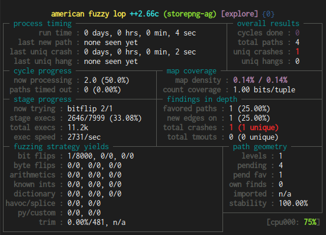

# Phase 01: Fuzzing native binaries at snails pace

## Introduction

This section aims to introduce you to standard tools for fuzzing binaries. 
Fuzzing can be augmented by the use of source code if available, but we 
assume in this section that you do not have access to the source you wish to 
fuzz. This might happen if you are testing commercial or closed source software 
for issues on your systems, for example. 

One of the original fuzzing tools is called American Fuzzy Lop. Written by 
a Google Engineer, this tool has several modes to support fuzzing with and 
without access to the source code.

A community version of the project, AFL++, includes compatibility fixes for 
more modern operating systems and later modes. This tutorial will use AFL++. 
We strongly recommend you use AF++, as you will likely need to do things like 
patch qemu and find python2 binaries otherwise.

In the rest of this documentation, TUTORIAL_REPO_DIR refers to the location 
you found your repository in. 

__**ATTENTION**__

Before you begin copying and pasting commands from this section, ready-made 
scripts exist in this folder for all commands you can see here. For each section you 
will find a script that performs the commands from that part, so that you 
do not need to copy and paste commands from the readme. This documentation 
exists so you can see what is done and why.

## Download and Build AFL++

The first step of this tutorial is to download and build AFL. The script in the 
root of this tutorial will do this for you. 

First we check out the latest version of AFL++:

```
git clone https://github.com/AFLplusplus/AFLplusplus aflplusplus
git checkout "2.66c"
```

into a directory `aflplusplus`. We have used the optional output name in git 
to remove the capital letters, which is easier on Linux. 
We now need to build the tool:

```
cd afplusplus
make
```

Wait a little while. This will build afl locally after some time. Once this is 
done we also need to build support for Qemu mode:

```
cd qemu_mode
./build_qemu_support.sh
```

Again, this will take some time, but once done you will see a success message.

**Script to run**: TUTORIAL_REPO_DIR/setup.sh

## Learn how to use AFL++ with storepng

We are now going to demonstrate a working fuzz project with AFL++. 

To make your life easier, we have a script to add AFL to the path. In the 
root of the tutorial repository you should see a plain file called "tools". 
Simply run:

```shell
source tools
```

in your shell. Now you should be able to run:

```
afl-fuzz
```

and it will execute the fuzzing command from the correct directory.

Now, enter the playground folder if you are not there already:

```
cd playground
```

Now that you are in the playground directory, create a working directory where 
we will fuzz from:

```
mkdir -p work-native
```

**Script**: 01-setup-workdir.sh

We will come back to this. Now you should be able to examine the folders 
you have available. Here is an annotated listing of the playground 
directory:

```
├── bin                 - binaries
│   ├── loadpng         - the loadpng program
│   └── storepng        - the storepng program 
├── inputs              - valid inputs the fuzzer can use to train
│   ├── loadpng         - loadpng input cases
│   │   ├── palette.png
│   │   └── rgba.png
│   └── storepng        - storepng input cases
│       ├── testcase01
│       ├── testcase02
│       ├── testcase03
│       └── testcase04
├── README.md           - a readme file
└── src                 - the source used to create the binaries
    ├── crc.c
    ├── crc.h
    ├── libz.a
    ├── loadpng.c
    ├── Makefile
    ├── pngparser.c
    ├── pngparser.h
    └── storepng.c
```

As you can see, we have provided the source to the binaries. We will not use 
this, but it is available if you wish to experiment.

Now to run `afl-fuzz` we need several pieces of information:

 - The binary we will fuzz.
 - A directory of input test cases.
 - A storage directory for fuzzing results
 - The current working directory.

`storepng` takes a single argument, the source of randomness used to render a 
PNG. Using this we can provide fuzz testcases. 

Without further ado, let us execute a fuzzing run:

```
cd work-native
afl-fuzz -Q -i ../inputs/storepng -o ../fuzz-native/ -- ../bin/storepng @@
```

The commands to `afl-fuzz` are as follows:

 - `-Q` instructs AFL++ to run in Qemu mode. We are pretending we do not have 
   the source for this test case, so this is necessary here.
 - `-i ../inputs/storepng` loads the input test cases from the input directory.
 - `-o ../fuzz-native/` tells afl++ where to store its information.
 - `-- ../bin/storepng @@` is a bit special. There are three parts to this 
   command: `--`, which terminates the argument list, the path to the 
   program to be fuzzed, and `@@`. This is a placeholder which tells AFL++ 
   which argument may be substituted for input by the fuzzer. In other words, 
   this is how the test cases are supplied.

If all goes well, you should see output like this:



Whenever you want to stop the fuzzing operation, you can press `CTRL+C` 
as you would to exit any terminal program. Fuzzing will then terminate.

This may take some time.

**Script**: 02-native-fuzz.sh

## Examining bugs

There is no script for this section, but it is interesting to examine crashes 
sometimes. AFL++ stores in its fuzz output directory an input that lead to 
each unique crash. How do we look at this? Well, we can find the crashes 
from the playground as follows:

```shell
ls playground/fuzz-native/crashes
```

These are inputs that were provided to the program in place of the `@@`. 
The name gives you some information as to the strategy AFL used to find this 
particular crash. If we want to actually look at the crash, we can do this:

```shell
cd playground
gdb bin/storepng
run fuzz-native/crashes/...
```

where `fuzz-native/crashes/...` is the name of a particular crash in question. 
This will run the command with that particular file as an argument, exactly 
what we want. Under gdb we can then see the stack trace:


## Cleanup

To clean up, we simply remove the work directory. Since storepng outputs a 
lot of files, the easiest method to remove it is to remove the entire directory 
in one go:

```sh
cd ..
rm -rf work-native
```

**Script**: 04-cleanup.sh
