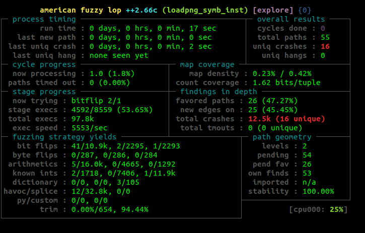

# Phase 02: instrumenting native binaries to collect coverage

## Introduction

This section aims to introduce you to static binaries rewriting using the tool [retrowrite](https://github.com/HexHive/retrowrite)
PLease read the carefully the 

In the rest of this documentation, TUTORIAL_REPO_DIR refers to the location 
you found your repository in. 
__**ATTENTION**__

Before you begin copying and pasting commands from this section, ready-made 
scripts exist in this folder for all commands you can see here. For each section you 
will find a script that performs the commands from that part, so that you 
do not need to copy and paste commands from the readme. This documentation 
exists so you can see what is done and why.

## Downstore and Build AFL++

The installation from the 01-native-fuzzing step should be good for this part.

**Script to run**: TUTORIAL_REPO_DIR/setup.sh
in order to install retrowrite dependancies.

## Learn how to instrument a binary

```shell
source tools
cd playground/bin
```
To generate symbolized assembly you can use the following command:
```shell
retrowrite storepng storepng_symb.s
```
You will get an ASCII file containing ASM instruction of the binary.
Now you will need to recompile a binary with AFL instrumentations.

In order to do that you will need to use afl-gcc command:
```shell 
AFL_AS_FORCE_INSTRUMENT=1 $AFL_PATH/afl-gcc storepng_symb.s -o storepng_symb_inst -lz

# to verify that the recompilation went good
./store_symb_inst

cd ../
```
**Script**: 01-instrument_symb.sh

## Learn how to use AFL++ with storepng_symb_inst

We are now going to demonstrate a working fuzz project with AFL++. 


in your shell. Now you should be able to run:

```
afl-fuzz
```

and it will execute the fuzzing command from the correct directory.


Now that you are in the playground directory, create a working directory where 
we will fuzz from:

```
mkdir -p work-symb
```

As you can see, we have provided the source to the binaries. We will not use 
this, but it is available if you wish to experiment.

Now to run `afl-fuzz` we need several pieces of information:

 - The binary we will fuzz.
 - A directory of input test cases.
 - A storage directory for fuzzing results
 - The current working directory.


Without further ado, let us execute a fuzzing run:

```
cd work-symb
../../aflplusplus/afl-fuzz -i ../inputs/storepng -o ../fuzz-sym/ -- ../bin/storepng_symb_inst @@
```

The commands to `afl-fuzz` are as follows:

 - `-i ../inputs/storepng` stores the input test cases from the input directory.
 - `-o ../fuzz-sym/` tells afl++ where to store its information.
 - `-- ../bin/storepng_symb_inst @@` is a bit special. There are three parts to this 
   command: `--`, which terminates the argument list, the path to the 
   program to be fuzzed, and `@@`. This is a placeholder which tells AFL++ 
   which argument may be substituted for input by the fuzzer. In other words, 
   this is how the test cases are supplied.

If all goes well, you should see output like this:



Whenever you want to stop the fuzzing operation, you can press `CTRL+C` 
as you would to exit any terminal program. Fuzzing will then terminate.

This may take some time.

**Script**: 02-symb-fuzzing.sh

**Script**: 02-symb-fuzzing-store.sh

## Examining bugs

There is no script for this section, but it is interesting to examine crashes 
sometimes. AFL++ stores in its fuzz output directory an input that lead to 
each unique crash. How do we look at this? Well, we can find the crashes 
from the playground as follows:

```shell
ls playground/fuzz-sym/crashes
```

These are inputs that were provided to the program in place of the `@@`. 
The name gives you some information as to the strategy AFL used to find this 
particular crash. If we want to actually look at the crash, we can do this:

```shell
cd playground
gdb bin/storepng_symb_inst
run fuzz-sym/crashes/...
```

where `fuzz-sym/crashes/...` is the name of a particular crash in question. 
This will run the command with that particular file as an argument, exactly 
what we want. Under gdb we can then see the stack trace:


 