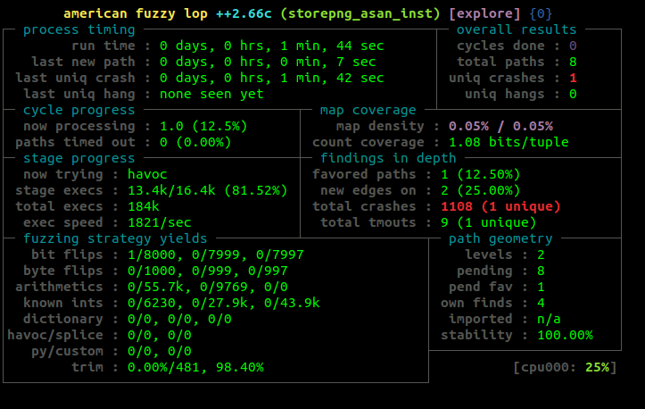

# Phase 03: instrumenting native binaries with coverage tracking and sanitization

## Introduction

This section aims to introduce you to static binaries rewriting using the tool [retrowrite](https://github.com/HexHive/retrowrite)

For more information about retrowrite tool and fuzzing, please refer to the presentation or read the retrowrite documentation (available in the public repository).

In the rest of this documentation, TUTORIAL_REPO_DIR refers to the location 
you found your repository in. 

__**ATTENTION**__

Before you begin copying and pasting commands from this section, ready-made 
scripts exist in this folder for all commands you can see here. For each section you 
will find a script that performs the commands from that part, so that you 
do not need to copy and paste commands from the readme. This documentation 
exists so you can see what is done and why.

## Download and Build AFL++

The installation from the 01-native-fuzzing step should correctly set up the tools needed for this part.

In case you didn't run the script during 01-native-fuzzing phase, you can run the following script:

**Script to run**: [TUTORIAL_REPO_DIR/setup.sh](../setup.sh) 

## Learn how to instrument a binary with ASan

```shell
source tools
cd playground/bin
```
To generate symbolized assembly you can use the following command:
```shell
retrowrite storepng storepng_asan.s --asan
```

You will get an ASCII file containing the assembler instructions of the binary.

Now you will need to recompile the binary with AFL instrumentations.

In order to do that you will need to use the following commands:
```shell 
sed -i 's/asan_init_v4/asan_init/g' storepng_asan.s
AFL_AS_FORCE_INSTRUMENT=1 afl-gcc storepng_asan.s -o storepng_asan_inst -lz -fsanitize=address

# to verify that the recompilation worked, run the binary
./storepng_asan_inst

cd ../
```
**Script**: [01-instrument_asan.sh](01-instrument_asan.sh)

## Learn how to use AFL++ with storepng_asan_inst

Now, we are going to demonstrate a working fuzzing campaign with AFL++. 

In your shell you should be able to run:

```
afl-fuzz
```

And it will execute the fuzzing command from the correct directory.


Now that you are in the playground directory, create a working directory where we will fuzz from:

```
mkdir -p work-asan-storepng
```

As you can see, we have provided the source to the binaries. We will not use this, but it is available if you wish to experiment.

Now to run `afl-fuzz` we need several pieces of information:

 - The binary we will fuzz.
 - A directory of input test cases.
 - A storage directory for fuzzing results
 - The current working directory.


Without further ado, let us execute a fuzzing run:

```
cd work-asan
afl-fuzz -i ../inputs/storepng -o ../03-fuzz-asan-storepng/ -- ../bin/storepng_asan_inst @@
```

The commands to `afl-fuzz` are as follows:

 - `-i ../inputs/storepng` stores the input test cases from the input directory.
 - `-o ../03-fuzz-asan-storepng/` tells afl++ where to store its information.
 - `-- ../bin/storepng_asan_inst @@` is a bit special. There are three parts to this 
   command: `--`, which terminates the argument list, the path to the 
   program to be fuzzed, and `@@`. This is a placeholder which tells AFL++ 
   which argument may be substituted for input by the fuzzer. In other words, 
   this is how the test cases are supplied.

If all goes well, you should see output like this:



Whenever you want to stop the fuzzing operation, you can press `CTRL+C` 
as you would to exit any terminal program. Fuzzing will then terminate.

This may take some time.

**Script**: [02-asan-fuzzing-loadpng.sh](02-asan-fuzzing-loadpng.sh) 

**Script**: [03-asan-fuzzing-storepng.sh](03-asan-fuzzing-storepng.sh)


## Examining bugs

There is no script for this section, but it is interesting to examine crashes 
sometimes. AFL++ stores in its fuzz output directory an input that lead to 
each unique crash. How do we look at this? Well, we can find the crashes 
from the playground as follows:

```shell
ls playground/03-fuzz-asan-storepng/crashes
```

These are inputs that were provided to the program in place of the `@@`. 
The name gives you some information as to the strategy AFL used to find this 
particular crash. If we want to actually look at the crash, we can do this:

```shell
cd playground
gdb bin/storepng_asan_inst
run 03-fuzz-asan-storepng/crashes/...
```

where `03-fuzz-asan-storepng/crashes/...` is the name of a particular crash in question. 
This will run the command with that particular file as an argument, exactly 
what we want. Under gdb we can then see the stack trace:


 ## Cleanup

To clean up, we simply remove the work directory. Since storepng outputs a 
lot of files, the easiest method to remove it is to remove the entire directory 
in one go:

```sh
cd ..
rm -r work-asan-loadpng
rm -r work-asan-storepng

```

**Script**: [04-cleanup.sh](04-cleanup.sh)
